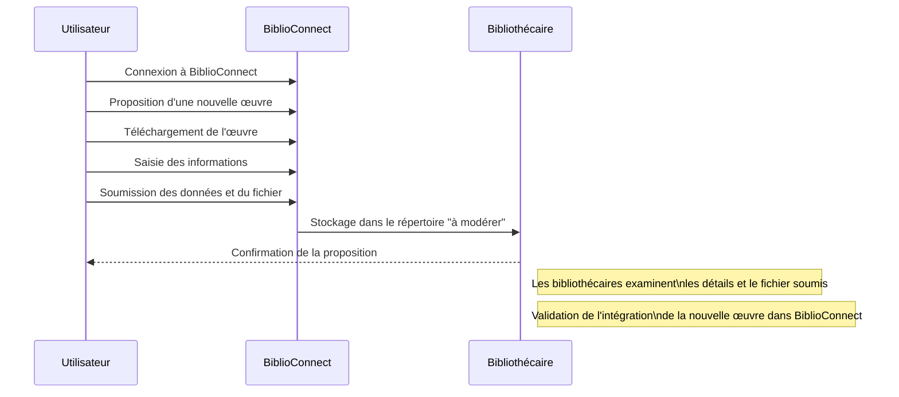
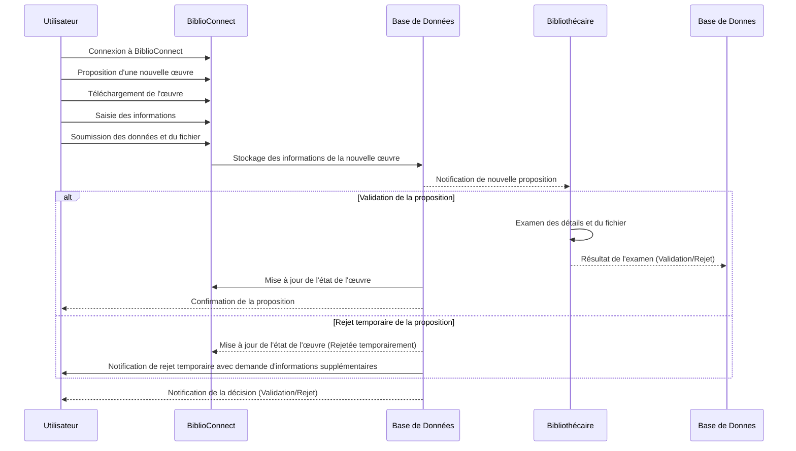
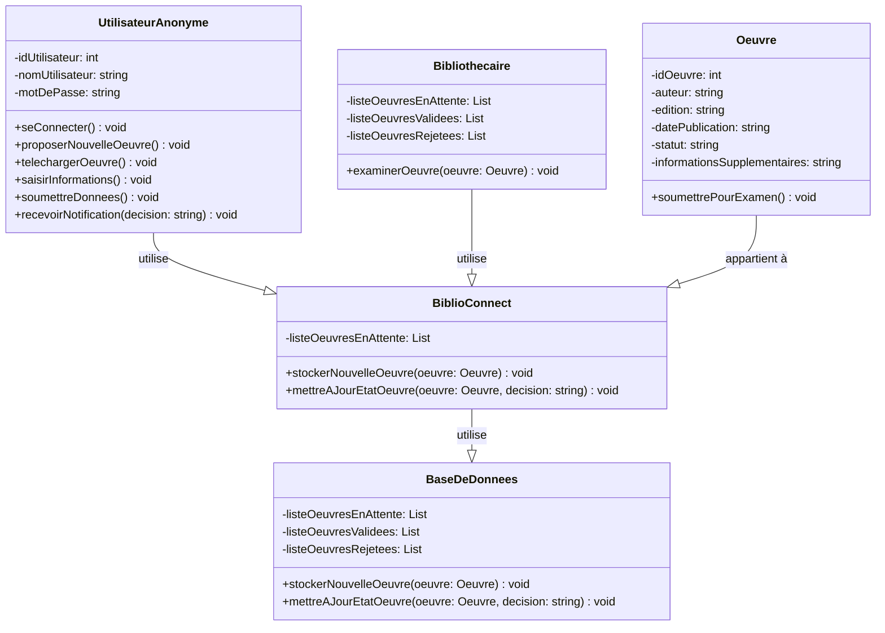

--- S1 
### Ajout d'une œuvre au répertoire "à modérer" : Proposition d'une nouvelle œuvre

**Description :** Un utilisateur anonyme propose une nouvelle œuvre pour intégration dans la bibliothèque numérique BiblioConnect.

**Acteurs :** Utilisateur Anonyme, Bibliothécaires actifs

**Précondition :** Connexion à l'application de la bibliothèque numérique.

**Étapes détaillées :**

1. **Connexion à BiblioConnect :** Un utilisateur anonyme accède à l'application de la bibliothèque numérique, BiblioConnect.

2. **Proposition de l'œuvre :** L'utilisateur repère l'option permettant de soumettre une nouvelle œuvre pour ajout à BiblioConnect.

3. **Téléchargement de l'œuvre :** L'utilisateur sélectionne le fichier numérique de l'œuvre depuis son dispositif pour l'ajouter à la bibliothèque.

4. **Saisie des informations :** Il complète un formulaire avec les détails pertinents de l'œuvre, tels que l'auteur, édition, date de publication, éditeur, et catégorie.

5. **Soumission des données et du fichier :** Une fois les détails complétés, il envoie les informations et le fichier correspondant à BiblioConnect.

6. **Stockage dans le répertoire "à modérer" :** Ces informations sont stockées dans le répertoire "à modérer" de BiblioConnect, en attente d'examen et de validation par les bibliothécaires.

7. **Examen par les bibliothécaires :** Les bibliothécaires examinent les détails et le fichier soumis pour valider l'intégration de cette nouvelle œuvre dans BiblioConnect.

**Scenario alternatif :**

Après la soumission de l'œuvre, la bibliothèque détecte des incohérences dans les informations fournies et envoie une notification à l'utilisateur anonyme demandant des détails supplémentaires. L'utilisateur fournit les informations manquantes, mais ces dernières ne suffisent pas pour garantir l'authenticité de l'œuvre. Les bibliothécaires décident de rejeter temporairement la proposition en attendant des informations plus complètes.

### Diagramme de séquence (abstrait)

### Diagramme de séquence (concret)

### Diagramme de classe

