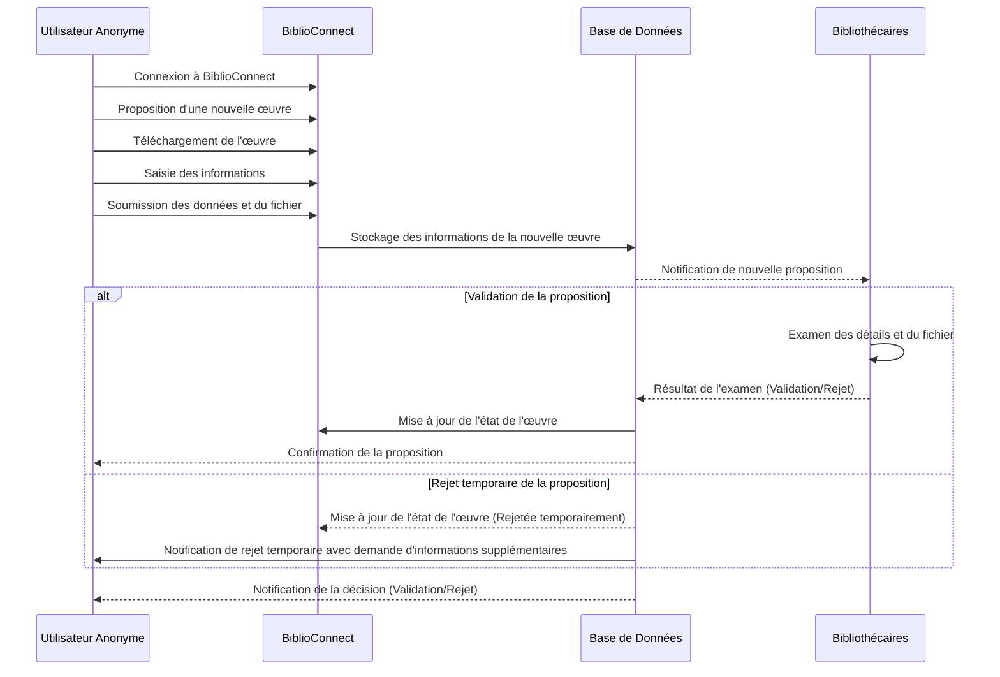

```mermaid
sequenceDiagram
    participant Utilisateur Anonyme
    participant BiblioConnect
    participant Base de Données
    participant Bibliothécaires

    Utilisateur Anonyme ->> BiblioConnect: Connexion à BiblioConnect
    Utilisateur Anonyme ->> BiblioConnect: Proposition d'une nouvelle œuvre
    Utilisateur Anonyme ->> BiblioConnect: Téléchargement de l'œuvre
    Utilisateur Anonyme ->> BiblioConnect: Saisie des informations
    Utilisateur Anonyme ->> BiblioConnect: Soumission des données et du fichier
    BiblioConnect ->> Base de Données: Stockage des informations de la nouvelle œuvre
    Base de Données -->> Bibliothécaires: Notification de nouvelle proposition

    alt Validation de la proposition
        Bibliothécaires ->> Bibliothécaires: Examen des détails et du fichier
        Bibliothécaires -->> Base de Données: Résultat de l'examen (Validation/Rejet)
        Base de Données ->> BiblioConnect: Mise à jour de l'état de l'œuvre
        Base de Données -->> Utilisateur Anonyme: Confirmation de la proposition
    else Rejet temporaire de la proposition
        Base de Données -->> BiblioConnect: Mise à jour de l'état de l'œuvre (Rejetée temporairement)
        Base de Données ->> Utilisateur Anonyme: Notification de rejet temporaire avec demande d'informations supplémentaires
    end
    Base de Données -->> Utilisateur Anonyme: Notification de la décision (Validation/Rejet)

```
