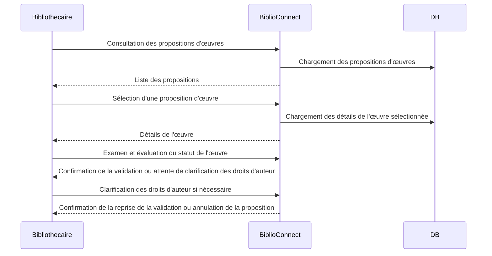
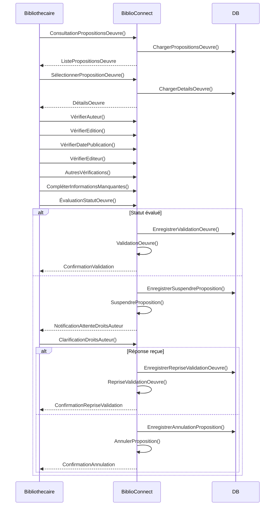

--- S2
### Validation d'une œuvre par les bibliothécaires

**Description :** Les bibliothécaires examinent et valident les propositions d'œuvres pour leur intégration dans la bibliothèque numérique.

**Acteurs :** Bibliothécaires.

**Précondition :** Proposition d'une œuvre par un membre.

**Étapes détaillées :**

1. **Réception des propositions :** Après qu'un membre a soumis une proposition d'œuvre pour l'intégrer dans la bibliothèque, celle-ci est transmise au groupe de bibliothécaires actifs.

2. **Examen des données :** Les bibliothécaires vérifient méticuleusement les informations fournies avec l'œuvre, y compris les détails de l'auteur, l'édition, la date de publication, l'éditeur, et d'autres données pertinentes. 

3. **Complétion des informations manquantes :** Si certaines informations sont incomplètes ou manquantes, les bibliothécaires peuvent rechercher et ajouter les détails manquants pour assurer la clarté et la complétude des informations relatives à l'œuvre.

4. **Évaluation du statut de l'œuvre :** Après avoir examiné et complété les informations, les bibliothécaires décident du statut de l'œuvre. Ils déterminent si l'œuvre appartient au domaine public ou si elle est soumise à des droits d'auteur et nécessite des restrictions d'accès.

5. **Validation de l'œuvre :** Une fois que les données sont complètes et que le statut est évalué, les bibliothécaires valident l'œuvre pour son intégration dans la bibliothèque numérique.

**Scenario alternatif :**

Suite à la vérification des données, les bibliothécaires découvrent des informations contradictoires concernant les droits d'auteur. Ils contactent l'auteur de l'œuvre pour confirmer ces détails et ne reçoivent aucune réponse dans le délai imparti. Ceci conduit à une suspension temporaire de la proposition d'œuvre, en attendant la clarification des droits d'auteur.

### Diagramme de séquence (abstrait)


### Diagramme de séquence (concret)


### Diagramme de classe
```mermaid
```
