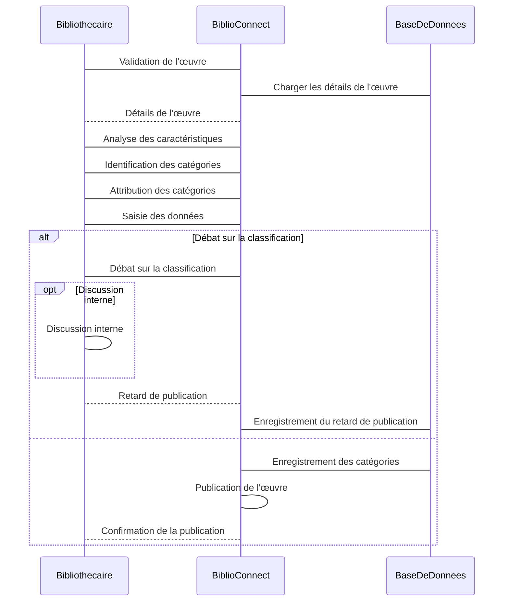
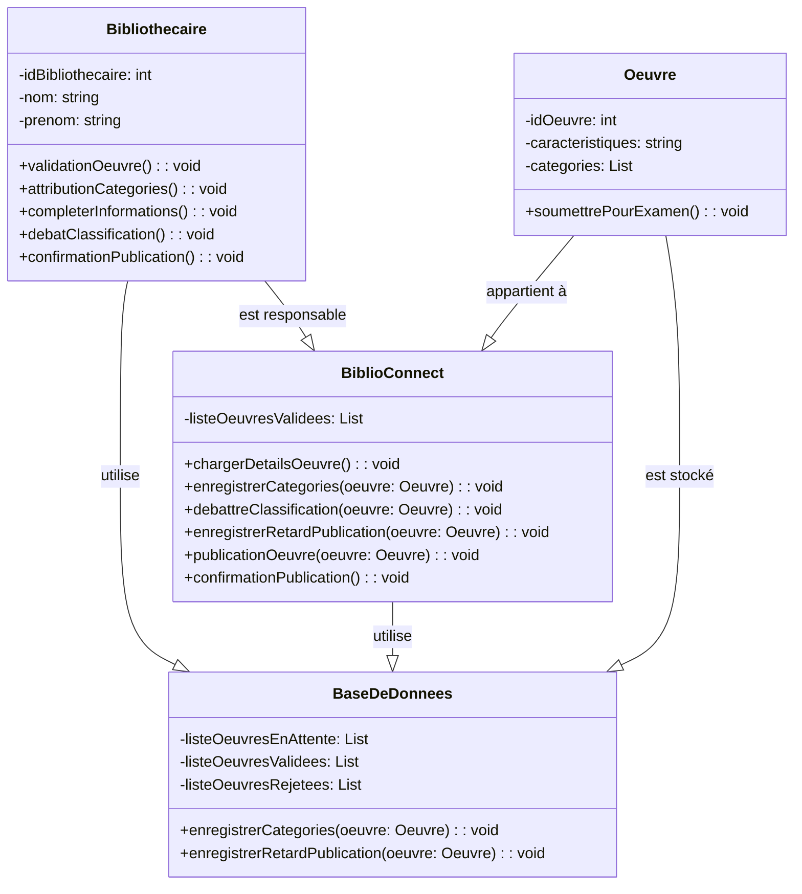

--- S3
### Classification d'une œuvre dans plusieurs catégories

**Description :** Les bibliothécaires attribuent des catégories à une œuvre pour une classification plus précise.

**Acteurs :** Bibliothécaires.

**Précondition :** Validation de l'œuvre.

**Étapes :**

1. **Validation de l'œuvre :** Une fois qu'une œuvre est validée pour inclusion dans la bibliothèque, les bibliothécaires commencent le processus de classification.

2. **Analyse des caractéristiques :** Les bibliothécaires examinent les caractéristiques de l'œuvre telles que son sujet, son genre, son style, son époque, et tout autre élément pertinent.

3. **Identification des catégories :** En se basant sur ces caractéristiques, ils déterminent les catégories les plus appropriées pour l'œuvre.

4. **Attribution des catégories :** L'œuvre est classée dans plusieurs catégories selon sa nature plurielle, et chaque catégorie est attribuée en conséquence.

5. **Saisie des données :** Les bibliothécaires enregistrent les catégories assignées à l'œuvre dans la base de données de la bibliothèque, assurant une indexation précise.

**Scenario alternatif :**

Un débat sur la classification d'une œuvre entre les bibliothécaires retarde la publication de l'œuvre, entraînant des retards dans la mise à disposition. Certains catégorisent l'œuvre dans une catégorie, tandis que d'autres suggèrent une autre, provoquant un délai supplémentaire pour la décision finale. 

### Diagramme de séquence (concret)

### Diagramme de classe

