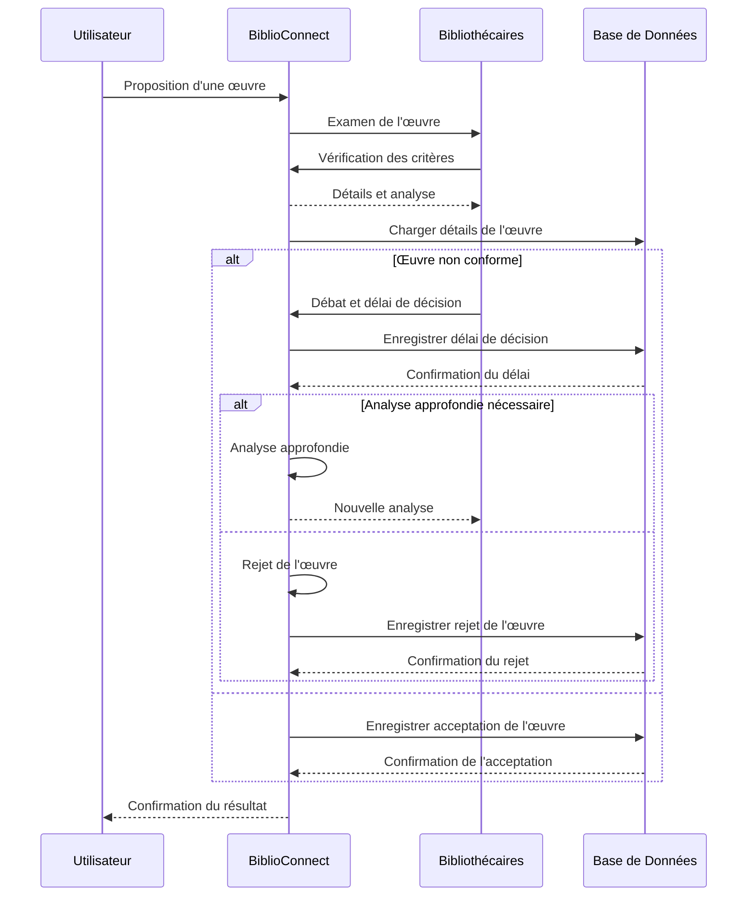
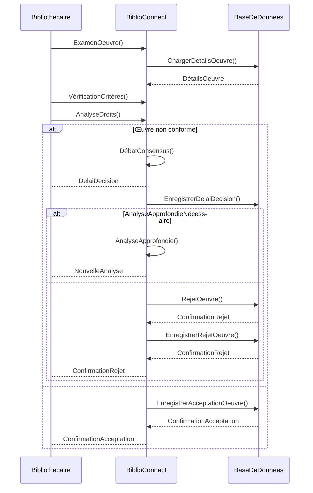
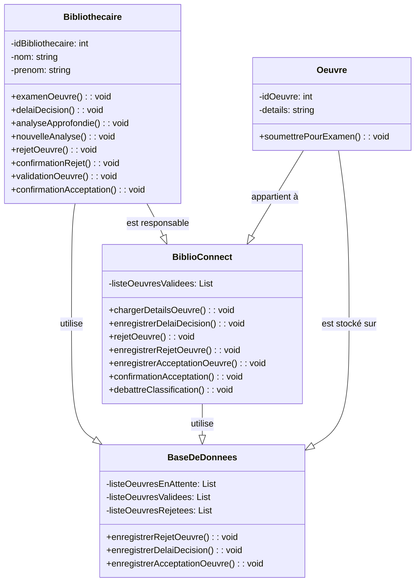

--- S4
### Rejet d'une œuvre après modération

**Description :** L'œuvre proposée ne répond pas aux critères ou aux droits requis, et est rejetée par les bibliothécaires.

**Acteurs :** Bibliothécaires.

**Précondition :** Proposition d'une œuvre pour intégration dans la bibliothèque.

**Étapes :**

1. **Examen de l'œuvre :** Les bibliothécaires passent en revue les détails et le contenu de l'œuvre soumise dans le répertoire "à modérer".

2. **Vérification des critères :** Ils vérifient si l'œuvre correspond aux critères de la bibliothèque, tels que la légalité, la qualité, la pertinence par rapport aux directives établies.

3. **Analyse des droits :** Les bibliothécaires s'assurent que l'œuvre respecte les droits d'auteur et tout autre droit applicable.

4. **Décision de rejet :** Si l'œuvre ne répond pas aux critères requis ou ne respecte pas les droits, les bibliothécaires décident de son rejet.

5. **Suppression de l'œuvre :** L'œuvre rejetée est retirée du répertoire "à modérer" et n'est pas intégrée à la bibliothèque numérique.

**Scenario alternatif :**

Une œuvre soumise n'a pas de violation directe des droits d'auteur mais suscite des inquiétudes concernant la conformité avec les règles de contenu de la bibliothèque. Les bibliothécaires ne parviennent pas à un consensus clair sur le rejet, nécessitant une analyse plus approfondie du contenu. Cela peut potentiellement entraîner des retards dans la décision finale.

### Diagramme de séquence (abstrait)

### Diagramme de séquence (concret)

### Diagramme de classe

